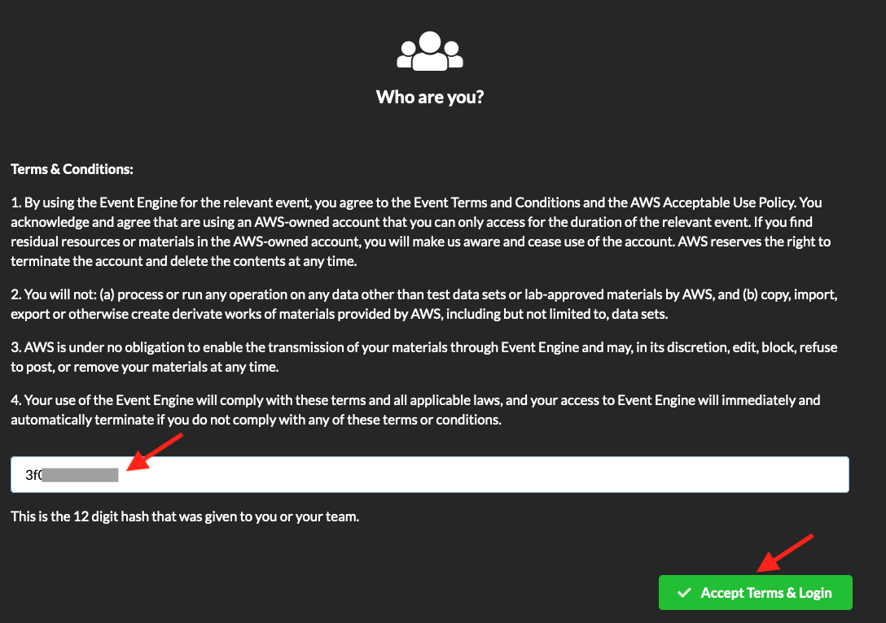
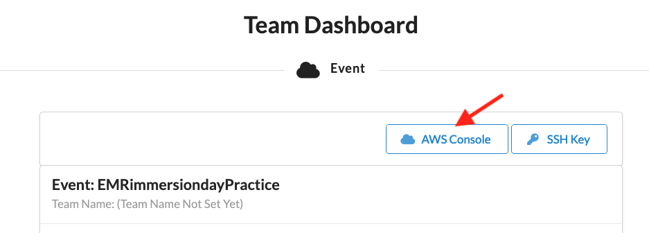
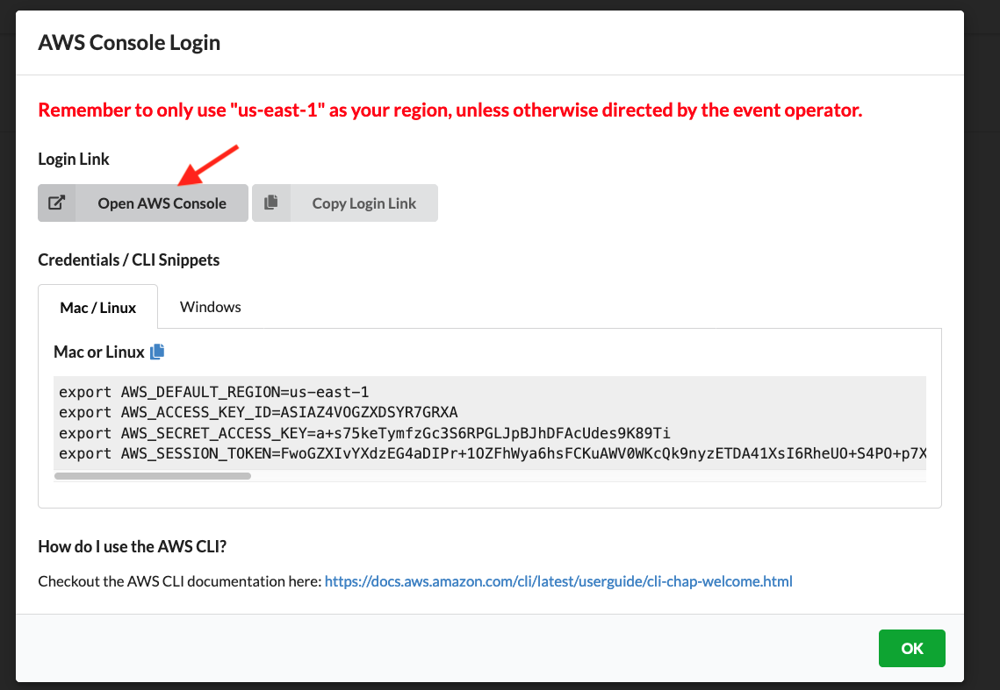
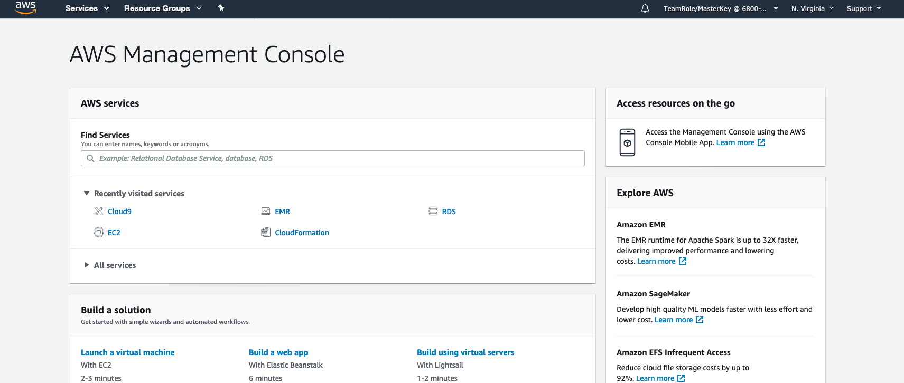

# Getting started with the Introduction to EMR Immersion Day

## Connect to the Event Engine

* In your browser, navigate to https://dashboard.eventengine.run/

Hint: Please use a browser other than Internet Explorer.

* Enter the 12 character hash code provided to you by your instructor and click Accept Terms & Login

* On the Team Dashboard page, click the AWS Console button

Note: If you get a message that the Event is Not Running, then please be patient and wait at this step.  Your Lab Instructor has not yet started the lab but will do so when ready.

## Launch the AWS Management Console

* On the AWS Console Login popup, click the Open AWS Console button

Note: If you get a message after clicking the Open AWS Console button that you need to first logout, then click on the logout link in the message.  Then go back to the Event Engine tab in your browser and click on the Open AWS Console button again.

* You should now have the AWS Management Console open

## Congratulations - you have started the lab and opened the AWS Management Console
Please continue to the [next section](L1b-Cloud9.md).

