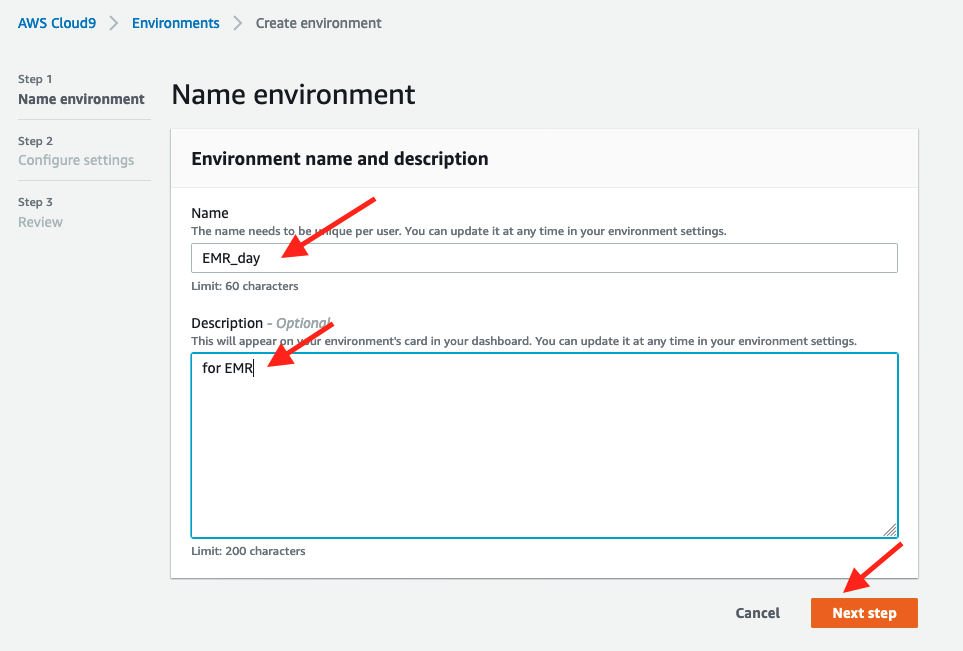
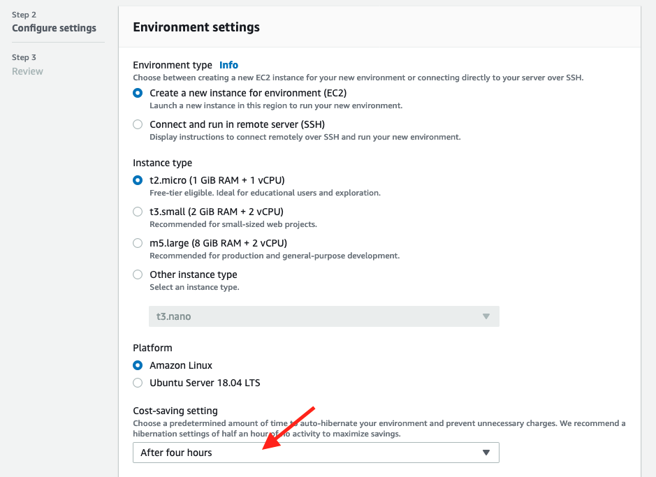
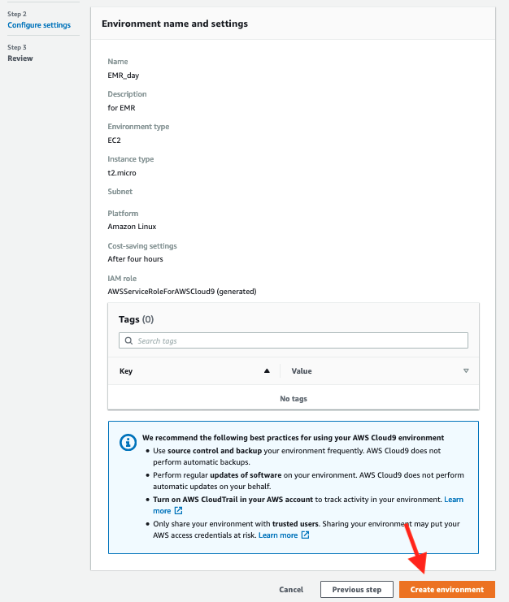
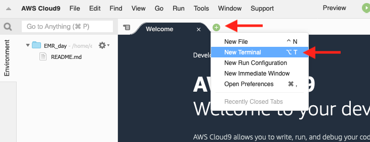
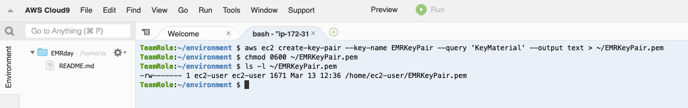

# Create a Cloud9 Development Environment

## Create a Cloud9 Development Environment

[AWS Cloud9](https://aws.amazon.com/cloud9/) is is a cloud-based integrated development environment (IDE) that lets you write, run, and debug your code with just a browser.

AWS Cloud9 comes with a terminal that includes sudo privileges to the managed Amazon EC2 instance that is hosting your development environment and a preauthenticated AWS Command Line Interface. This makes it easy for you to directly access AWS services, install additional software, do a git push, or enter commands.

### Navigate to the Cloud9 Console

* In the AWS Management Console, navigate to the Cloud9 console.  One way to do so, is to type "Cloud9" in the service search field and then click on the Cloud9 result.


The Cloud9 Console page should now open:


### Create a Cloud9 development environment

* In the Cloud9 console, click on the "Create environment" button 


* Enter "EMR_day" for the name.

* Fill in a description.

* Click "Next step"



* On the "Configure settings" page, change the Cost-saving setting to "After four hours"



* Click "Next step" to advance to the Review page

* At the bottom of the Review page, click "Create environment"



Cloud9 will now create your new environment.  It will take a few minutes for the environment to be ready.   While waiting, you can start to review the Cloud9 IDE tutorial in the step below.

### Get familiar with Cloud9
If you are new to Cloud9, review the IDE tutorial at [https://docs.aws.amazon.com/cloud9/latest/user-guide/tutorial-tour-ide.html](https://docs.aws.amazon.com/cloud9/latest/user-guide/tutorial-tour-ide.html)


## Create an EC2 Key Pair

Cloud9 automatically configures the AWS CLI for our user.  We will use the AWS CLI to create an EC2 Key Pair.  We will need this Key Pair to ssh into our EMR Cluster in a later exercise.


* Open up your Cloud9 environment if not already open


* Click on the + sign to the right of the Welcome Tab and use the pop-up menu to open a new Terminal tab as shown below:



* In the terminal, paste and run the following code to create an EC2 Key Pair

```
aws ec2 create-key-pair --key-name EMRKeyPair --query 'KeyMaterial' --output text > ~/EMRKeyPair.pem
chmod 0600 ~/EMRKeyPair.pem
ls -l ~/EMRKeyPair.pem

```

When the code is finished running, you should see output like this:




## Congratulations - you have created a Cloud9 Development Environment and an EC2 Key Pair
Please continue to the [next section](L1c-EMRCreate.md).

