# Launch an EMR Cluster and Connect

In this exercise, you will launch a new EMR Cluster.

The central component of Amazon EMR is the cluster. A cluster is a collection of Amazon Elastic Compute Cloud (Amazon EC2) instances. Each instance in the cluster is called a node. Each node has a role within the cluster, referred to as the node type. Amazon EMR also installs different software components on each node type, giving each node a role in a distributed application like Apache Hadoop.

The node types in Amazon EMR are as follows:

* Master node: A node that manages the cluster by running software components to coordinate the distribution of data and tasks among other nodes for processing. The master node tracks the status of tasks and monitors the health of the cluster. Every cluster has a master node, and it's possible to create a single-node cluster with only the master node.

* Core node: A node with software components that run tasks and store data in the Hadoop Distributed File System (HDFS) on your cluster. Multi-node clusters have at least one core node.

* Task node: A node with software components that only runs tasks and does not store data in HDFS. Task nodes are optional.

You can read more about the Architecture and Benefits of EMR [here](https://docs.aws.amazon.com/emr/latest/ManagementGuide/emr-overview.html).

## Create the EMR Cluster

### Navigate to the EMR Console

* In the AWS Management Console, navigate to the EMR console.  One way to do so, is to expand the Services top menu and type "EMR" in the service search field.

Hint: be sure to use a different browser tab than you are using for your Cloud9 Development Environment, as we will be returning to the Cloud9 tab later.

Hint: you might need to go back to your Event Engine browser tab to re-launch the AWS Management Console.  If you do so, close the Event Engine's "AWS Console Login" popup if it is still showing.  Then from the Event Engine Team Dashboard page, click the "AWS Console" button, then click the "Open AWS Console" button.  That will get you a new AWS Management Console browser tab.

### Create an EMR Cluster

* In the EMR Console, click the "Create cluster" button

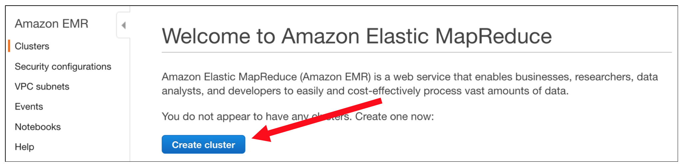

* Then click on the "Go to advanced options" link

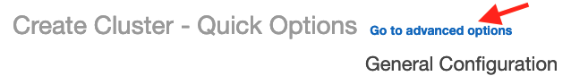

* Ensure that these components are checked: Hadoop, Hive, Spark, Tez, Pig

* Leave the rest of the page at their defaults and click Next

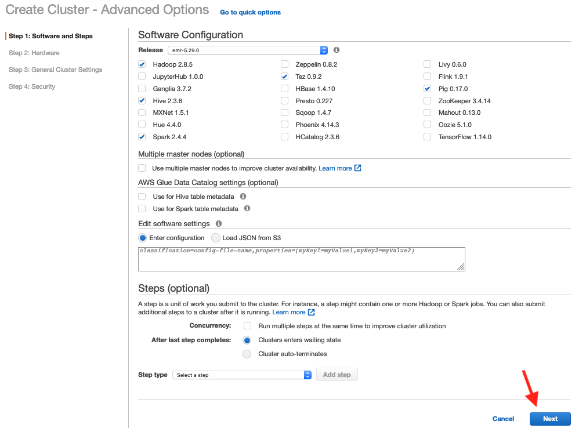

* Leave the Hardware Configuration page at their defaults and click Next

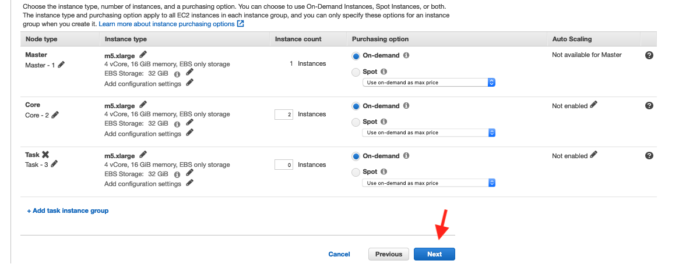

Aside: One of the great benefits of EMR is its cost-saving capabilities thanks to Spot Instances and Auto-Scaling.  You can read more about EMR and Spot Instances [here](https://docs.aws.amazon.com/emr/latest/ManagementGuide/emr-plan-instances-guidelines.html#emr-plan-spot-scenarios) and about Auto-Scaling [here](https://docs.aws.amazon.com/emr/latest/ManagementGuide/emr-scale-on-demand.html).

* Leave the General Options page at their defaults and click Next

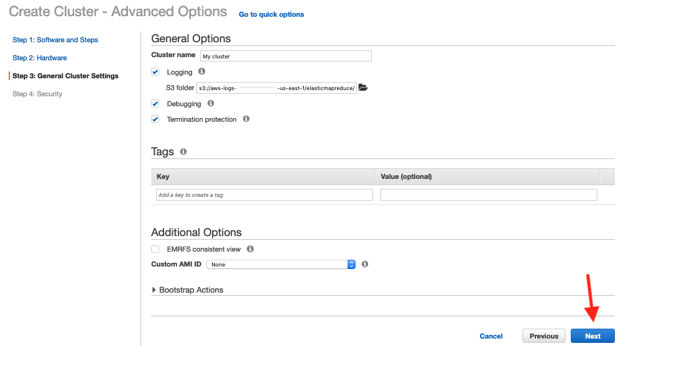

* On the Security Options page, choose the EMRKeyPair in the EC2 key pair drop-down.

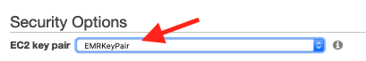

* Then click "Create cluster"

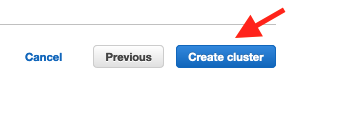

* Your cluster will start being provisioned:

### Update the Security Group for the Master Node

While the EMR Cluster is being provisioned, we will adjust the Security Group for the EMR master node to allows your Cloud9 environment to connect via SSH.  The Security Group acts as firewall controlling who can access which ports on EMR.

* Click on the refresh icon on the right hand side of the cluster details page to update the cluster details

* Click on the link for the Security groups for Master to launch the EC2 Security Groups console page in a new browser tab

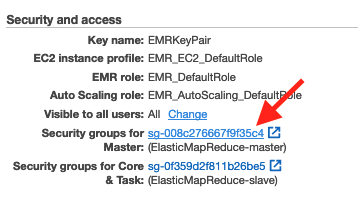

* On the Security Group page, click the checkbox in front of the master (ElasticMapReduce-master)

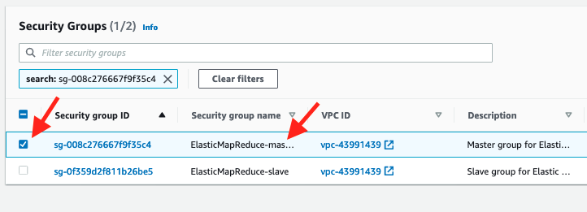

* In the bottom pane, click "Inboud rules" tab.  Then click the "Edit inbound rules" button

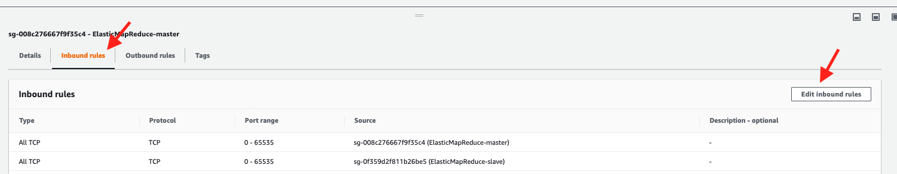

* Scroll to the bottom of the page and click the "Add rule" button

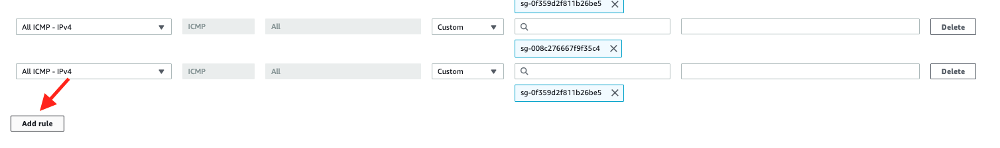

* For the new rule, pick SSH from the first drop down.  Leave the second drop-down as Custom.  In the Source field to the right, start typing "sg".  This will pop-up a list of your Security Groups.  Pick the one that begins AWS-Cloud9-EMR-day.

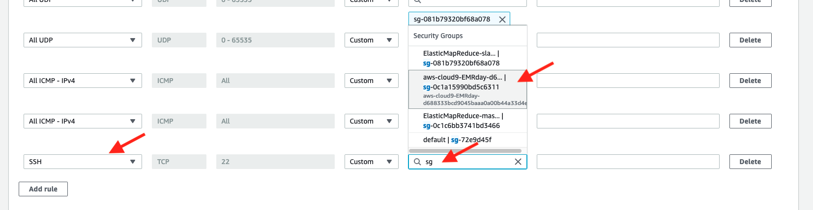

* Then click "Save rules"

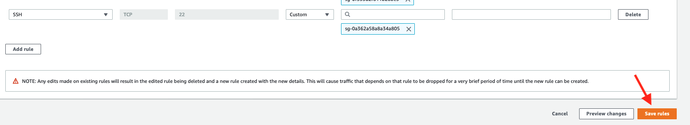

### Connect to your EMR Cluster

* Return to your EMR Console tab in your browser.  Your cluster should likely now say "Waiting Cluster ready".  You may also need to click the refresh icon on the right hand side of the page to refresh the details.  If it does not yet say Waiting, then wait a bit longer (ask your instructor if it has been more than 10 minutes)

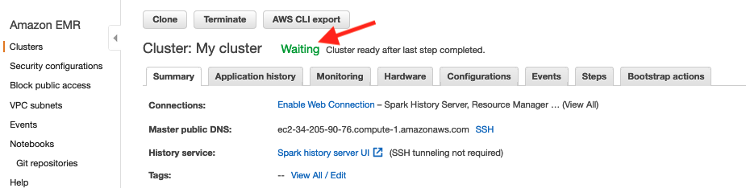

* Click on the SSH link next to your Master public DNS field

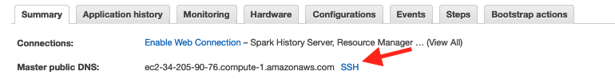

* Select the Mac/Linux tab.  Then highlight the ssh command and copy it to your clipboard

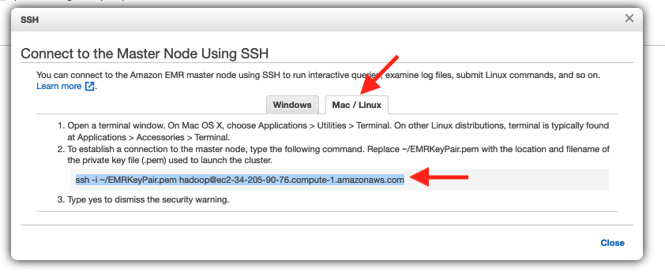

* Now return to your Cloud9 browser tab and paste the command into your Terminal tab inside the Cloud9 environment

* Hit enter to run the ssh command.  Type in yes when asked if you want to continue connecting.

## Congratulations - you have created an EMR Cluster and connected to it via SSH
Please continue to the [next section](L2a-S3.md).

