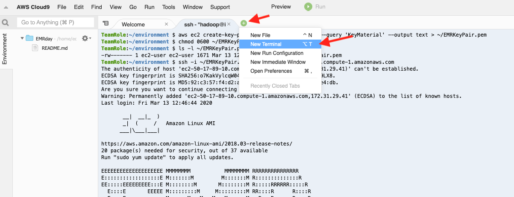
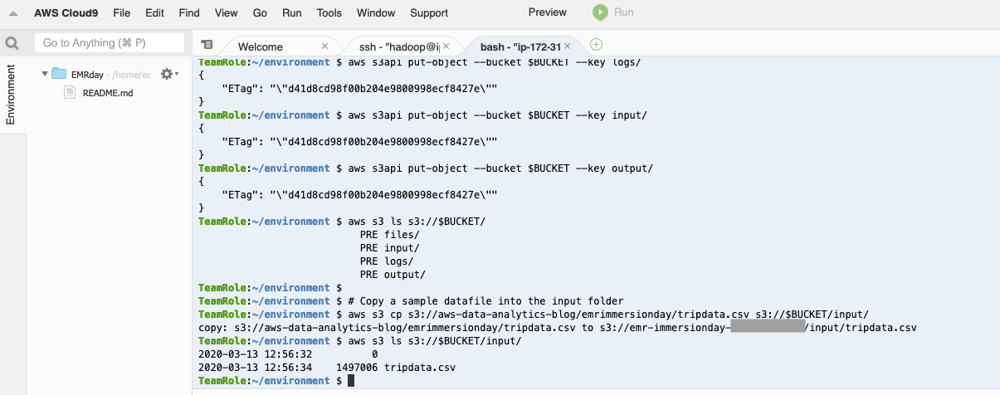

# Working with Hive and Pig

This lab demonstrates the steps involved in submitting Hive and Pig jobs on EMR.  Hive and Pig jobs can be submitted interactively via the Hive and Pig shells on the master node or jobs can be submitted directly to the cluster using the console, CLI, or EMR API.  Jobs can be submitted at cluster creation and the cluster can be auto-terminated afterwards (ephemeral clusters) or multiple jobs can be submitted to long living clusters.  In this lab we’ll go through submitting jobs interactively via shells and EMR steps.

## Create a S3 bucket and populate it with data

* In the Cloud9 environment, create a new terminal window.



* Copy the following code and paste and run it in the new terminal

```
## Sets up S3 bucket for you
export AWSACCOUNT=`aws sts get-caller-identity --query Account --output text`
export BUCKET=emr-immersionday-$AWSACCOUNT
echo S3 Bucket is $BUCKET

# Make the bucket
aws s3 mb s3://$BUCKET
aws s3 ls

# Setup a folder structure in the bucket
aws s3api put-object --bucket $BUCKET --key files/
aws s3api put-object --bucket $BUCKET --key logs/
aws s3api put-object --bucket $BUCKET --key input/
aws s3api put-object --bucket $BUCKET --key output/
aws s3 ls s3://$BUCKET/

# Copy a sample datafile into the input folder
aws s3 cp s3://aws-data-analytics-blog/emrimmersionday/tripdata.csv s3://$BUCKET/input/
aws s3 ls s3://$BUCKET/input/

```

Your terminal should now look similar to this:



## Congratulations - you have created a S3 bucket and populated it with data
Please continue to the [next section](L2b-HiveCLI.md).
