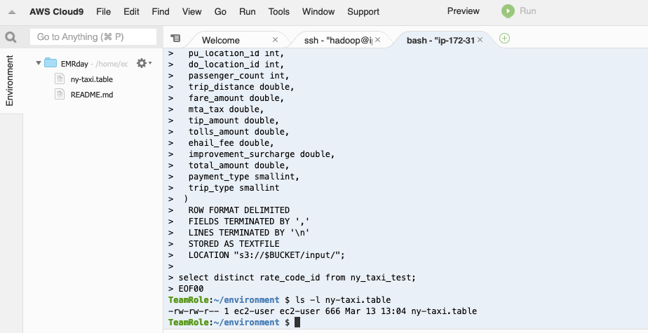
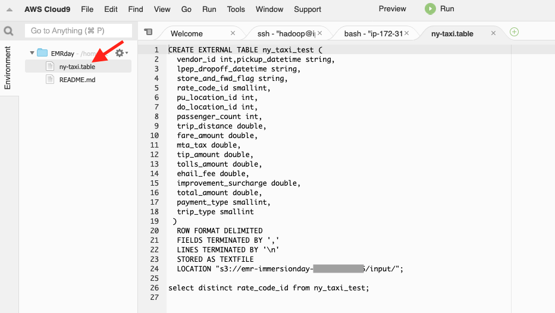
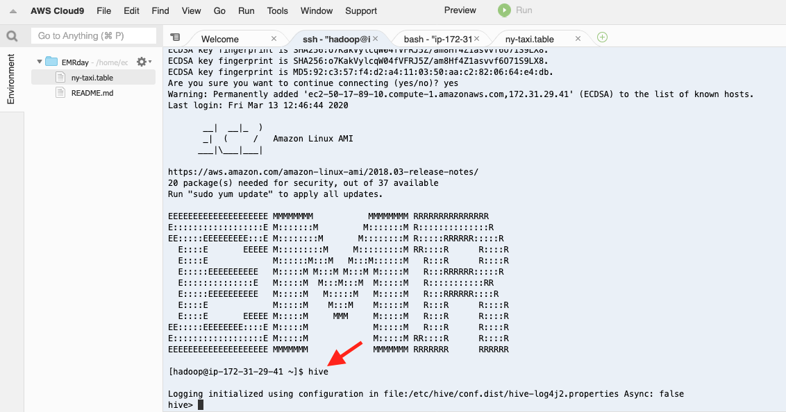
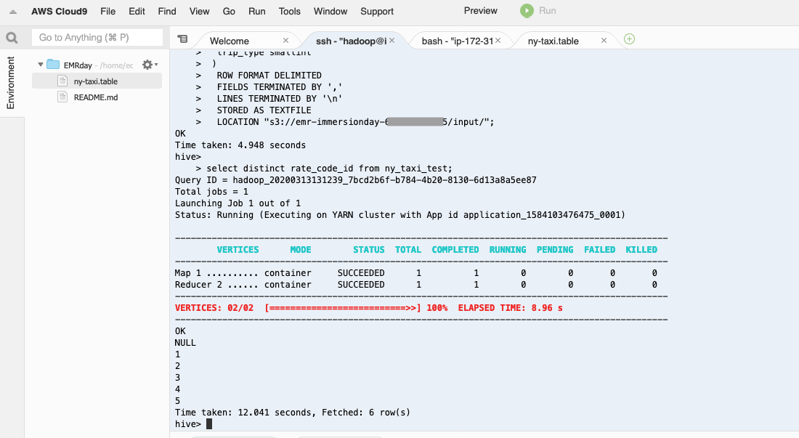

# # Working with Hive and Pig, continued

## Interacting with the Hive CLI

* In your Cloud9 environment, use the same terminal where you created your S3 bucket and run these commands:

```
## creates a ny-taxi.table file
cat <<EOF00 > ny-taxi.table
CREATE EXTERNAL TABLE ny_taxi_test (
  vendor_id int,pickup_datetime string,
  lpep_dropoff_datetime string,
  store_and_fwd_flag string,
  rate_code_id smallint,
  pu_location_id int,
  do_location_id int,
  passenger_count int,
  trip_distance double,
  fare_amount double,
  mta_tax double,
  tip_amount double,
  tolls_amount double,
  ehail_fee double,
  improvement_surcharge double,
  total_amount double,
  payment_type smallint,
  trip_type smallint
 )
  ROW FORMAT DELIMITED
  FIELDS TERMINATED BY ','
  LINES TERMINATED BY '\n'
  STORED AS TEXTFILE
  LOCATION "s3://$BUCKET/input/";

select distinct rate_code_id from ny_taxi_test; 
EOF00
ls -l ny-taxi.table

```

Your terminal should look similar to this:



* Open up the ny-taxi.table file in the Cloud9 editor by double-clicking on the ny-taxi.table icon in the hierarchy.



* Select all the text of the ny-taxi.table file and copy it to your clipboard

* Switch to the first terminal tab (the one you used to SSH into the EMR master node) in the Cloud9 environment and type "hive" to launch the Hive shell CLI



* Paste in the contents of the ny-taxi.table file from your clipboard

You should see output similar to this:



* Type "exit;" to exit the Hive Shell CLI

## Congratulations - you have interacted with Hive using the Hive CLI
You used the Hive Shell CLI to run a Hive CREATE EXTERNAL TABLE to define an external table pointing to your CSV datafile stored on S3 and then you ran a SELECT statement against your table to verify that it worked.

Please continue to the [next section](L2c-HiveStep.md).
