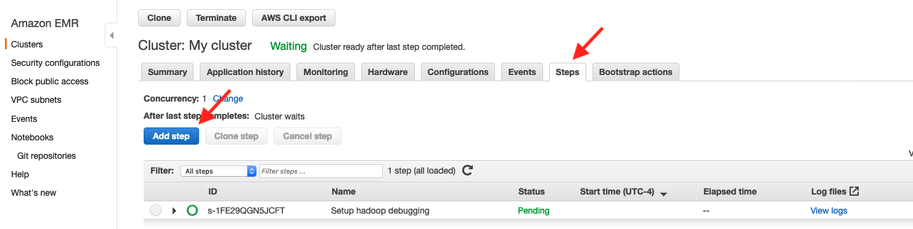
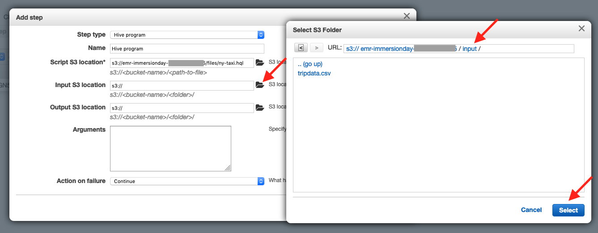
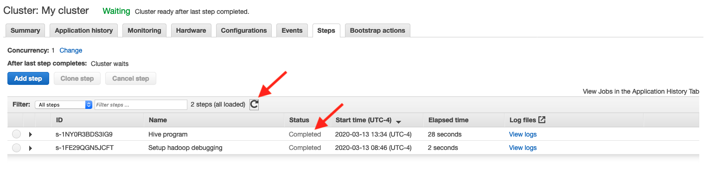
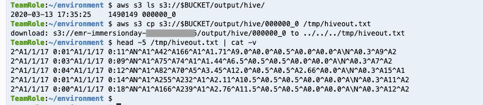

# # Working with Hive and Pig, continued

## Interacting with Hive via EMR Steps

* In your Cloud9 environment, use the same terminal where you created your S3 bucket (which is NOT the terminal where you are connected via SSH to EMR) and run these commands:

```
# create a HQL file and copy it into S3
cat <<\EOF00 > ny-taxi.hql
CREATE EXTERNAL TABLE ny_taxi (
  vendor_id int,pickup_datetime string,
  lpep_dropoff_datetime string,
  store_and_fwd_flag string,
  rate_code_id smallint,
  pu_location_id int,
  do_location_id int,
  passenger_count int,
  trip_distance double,
  fare_amount double,
  mta_tax double,
  tip_amount double,
  tolls_amount double,
  ehail_fee double,
  improvement_surcharge double,
  total_amount double,
  payment_type smallint,
  trip_type smallint
       )
 ROW FORMAT DELIMITED
 FIELDS TERMINATED BY ','
 LINES TERMINATED BY '\n'
 STORED AS TEXTFILE
 LOCATION "${INPUT}";

INSERT OVERWRITE DIRECTORY "${OUTPUT}"
SELECT * FROM ny_taxi WHERE rate_code_id = 1;
EOF00

aws s3 cp ny-taxi.hql s3://$BUCKET/files/
aws s3 ls s3://$BUCKET/files/

```

Your terminal should look similar to this:


* Now go to the EMR Console tab in your web browser and click on the Steps tab and click on the Add step button



* In the Add step popup, change the Step type to Hive program.


* Use the folder icon for the Script S3 location and navigate to the ny-taxi.hql file in the /files/ folder in your S3 bucket, then click Select


* Similarly for the Input S3 location and navigate to the /input/ folder in your S3 bucket, then click Select.  NOTE: You are selecting the /input/ folder, NOT the individual tripdata.csv file.



* And for the Output S3 location and navigate to the /output/ folder in your S3 bucket, then click Select.  Then append hive/ to the location.


* Finally, click Add.


* Now your Hive program is submitted to your cluster.  Use the Refresh icon to wait until your Step is completed.



* Now that your Hive program is finished, go back to your Cloud9 environment.  Use the same terminal where you created your S3 bucket (which is NOT the terminal where you are connected via SSH to EMR) and run these commands:

```
aws s3 ls s3://$BUCKET/output/
aws s3 ls s3://$BUCKET/output/hive/
aws s3 cp s3://$BUCKET/output/hive/000000_0 /tmp/hiveout.txt
head -5 /tmp/hiveout.txt | cat -v

```
Your terminal should look similar to this:



You can see that Hive wrote a datafile named 000000_0 to the /output/hive/ folder in S3.  And you can see that the format of the datafile is in standard Hive/Hadoop textfile format (ctrl-A separated fields).

## Congratulations - you have interacted with Hive using EMR Steps feature
You used the EMR Step functionality to submit a Hive script to your EMR cluster.  The Hive script defined another External Table against your CSV data on S3 and then it used a Hive INSERT..SELECT statement to create a new dataset in the S3 bucket's output folder.

Please continue to the [next section](L2d-PigStep.md).
