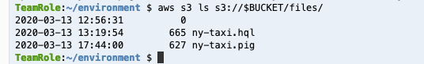
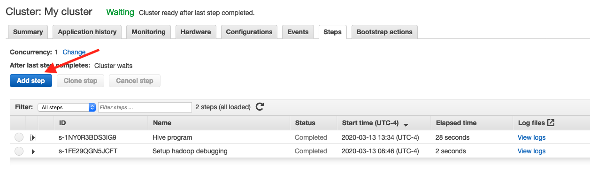
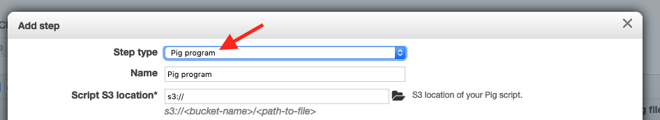
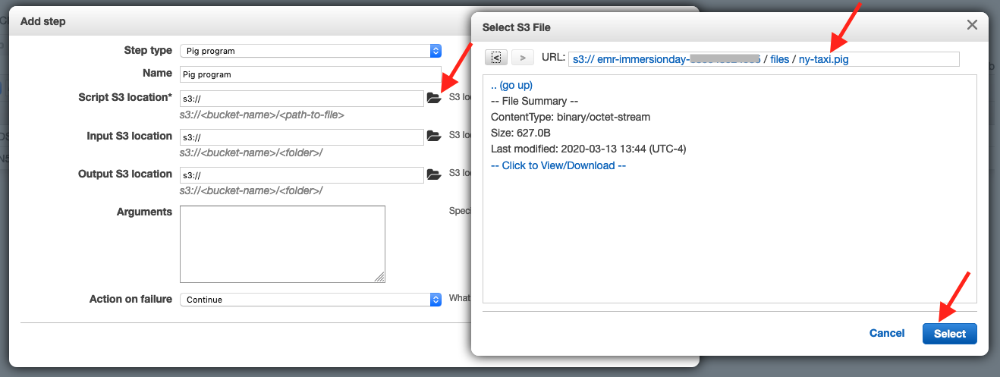
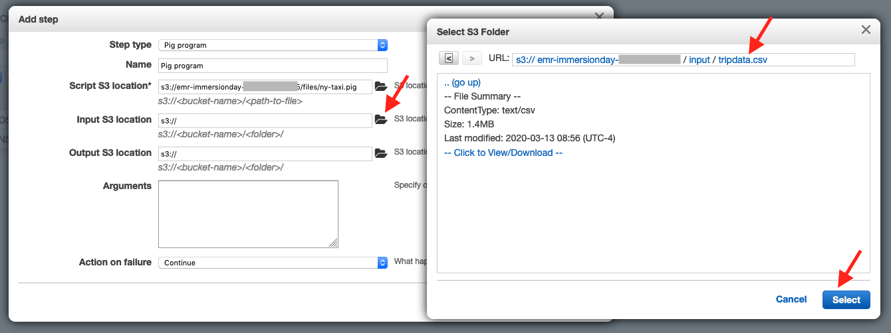
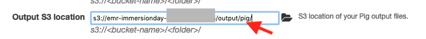
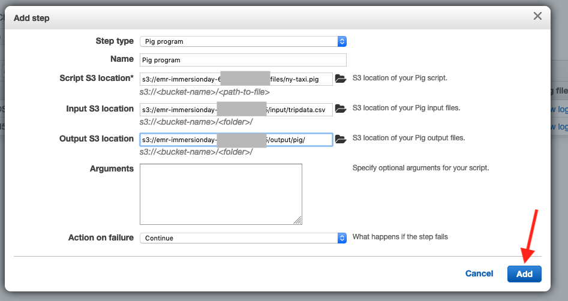
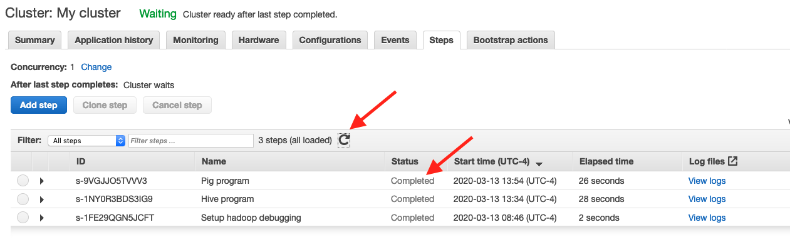
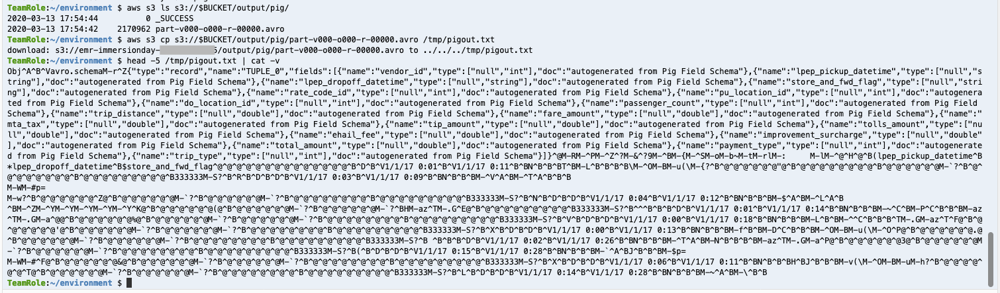

# Working with Hive and Pig, continued

## Interacting with Pig via EMR Steps

* In your Cloud9 environment, use the same terminal where you created your S3 bucket (which is NOT the terminal where you are connected via SSH to EMR) and run these commands:

```
# create a PIG file and copy it into S3
cat <<\EOF00 > ny-taxi.pig
DEFINE CSVLoader org.apache.pig.piggybank.storage.CSVLoader();

NY_TAXI = LOAD '$INPUT' USING CSVLoader(',') AS
  (vendor_id:int,
  lpep_pickup_datetime:chararray,
  lpep_dropoff_datetime:chararray,
  store_and_fwd_flag:chararray,
  rate_code_id:int,
  pu_location_id:int,
  do_location_id:int,
  passenger_count:int,
  trip_distance:double,
  fare_amount:double,
  mta_tax:double,
  tip_amount:double,
  tolls_amount:double,
  ehail_fee:double,
  improvement_surcharge:double,
  total_amount:double,
  payment_type:int,
  trip_type:int);
STORE NY_TAXI into '$OUTPUT' USING org.apache.pig.piggybank.storage.avro.AvroStorage();
EOF00

aws s3 cp ny-taxi.pig s3://$BUCKET/files/
aws s3 ls s3://$BUCKET/files/

```

Your terminal should look similar to this:



* Now go to the EMR Console tab in your web browser and click on the Steps tab and click on the Add step button



* In the Add step popup, change the Step type to Pig program.



* Use the folder icon for the Script S3 location and navigate to the ny-taxi.pig file in the /files/ folder in your S3 bucket, then click Select



* Similarly for the Input S3 location and navigate to the tripdata.csv file in the /input/ folder in your S3 bucket, then click Select.  NOTE: With Pig, you are selecting the individual tripdata.csv file, NOT the /input/ folder.



* And for the Output S3 location and navigate to the /output/ folder in your S3 bucket, then click Select.  Then append pig/ to the location.



* Finally, click Add.



* Now your Pig program is submitted to your cluster.  Use the Refresh icon to wait until your Step is completed.



* Now that your Pig program is finished, go back to your Cloud9 environment.  Use the same terminal where you created your S3 bucket (which is NOT the terminal where you are connected via SSH to EMR) and run these commands:

```
aws s3 ls s3://$BUCKET/output/pig/
aws s3 cp s3://$BUCKET/output/pig/part-v000-o000-r-00000.avro /tmp/pigout.txt
head -5 /tmp/pigout.txt | cat -v

```
Your terminal should look similar to this:



You can see that Pig wrote a datafile named part-v000-o000-r-00000.avro to the /output/pig/ folder in S3.  And while Avro is a binary format, you can see from the terminal that the datafile does appear to be in Avro format.

## Congratulations - you have interacted with Pig using EMR Steps feature
You used the EMR Step functionality to submit a Pig script to your EMR cluster.  The Pig script loaded a CSV datafile on S3, converted it to Avro, and wrote it as a new dataset in the S3 bucket's output folder.

Please continue to the [next section](L3a-SparkSubmit.md).
