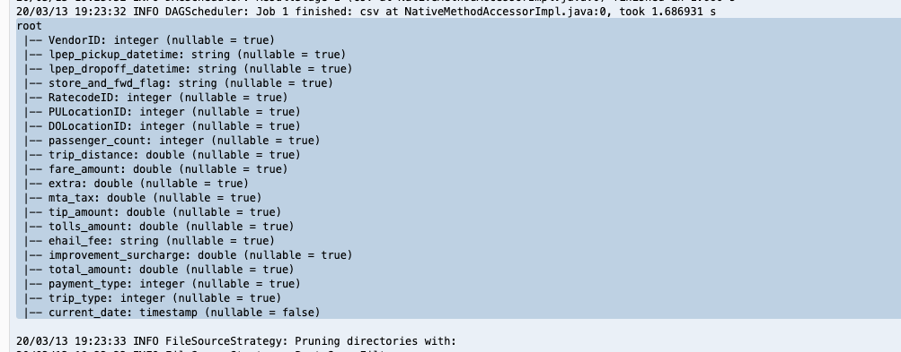

# # Working with Spark

This lab demonstrates submitting and monitoring Spark-based ETL work to an Amazon EMR cluster.

You can submit Spark job to your cluster interactively, or you can submit work as a EMR step using the console, CLI, or API. You can submit steps when the cluster is launched, or you can submit steps to a running cluster.


Job Description:

This sample ETL job does the following things:
- Read CSV data from Amazon S3
- Add current date to the dataset
- Write updated data back to Amazon S3 in Parquet format


## Interacting with Spark via spark-submit

* In your Cloud9 environment, use the same terminal where you created your S3 bucket (which is NOT the terminal where you are connected via SSH to EMR) and run these commands:

```
## get hostname of EMR Master node
export EMR_CLUSTER=`aws emr list-clusters --query Clusters[0].Id --output text`
export EMR_MASTER=`aws emr describe-cluster --cluster-id $EMR_CLUSTER --query Cluster.MasterPublicDnsName --output text`
echo EMR Master is $EMR_MASTER

## Create a PySpark script and copy it to EMR Master node
cat <<\EOF00 > spark-etl.py
import sys
from datetime import datetime

from pyspark.sql import SparkSession
from pyspark.sql.functions import *

if __name__ == "__main__":

    print(len(sys.argv))
    if (len(sys.argv) != 3):
        print("Usage: spark-etl [input-folder] [output-folder]")
        sys.exit(0)

    spark = SparkSession\
        .builder\
        .appName("SparkETL")\
        .getOrCreate()

    nyTaxi = spark.read.option("inferSchema", "true").option("header", "true").csv(sys.argv[1])

    updatedNYTaxi = nyTaxi.withColumn("current_date", lit(datetime.now()))

    updatedNYTaxi.printSchema()

    print(updatedNYTaxi.show())

    print("Total number of records: " + str(updatedNYTaxi.count()))
    
    updatedNYTaxi.write.parquet(sys.argv[2])
EOF00

scp -i ~/EMRKeyPair.pem spark-etl.py hadoop@$EMR_MASTER:spark-etl.py

echo RUN THIS COMMAND IN YOUR SSH TO EMR TERMINAL:
echo spark-submit spark-etl.py s3://$BUCKET/input/ s3://$BUCKET/output/spark

```

Your terminal should look similar to this:


* Select the spark-submit command text that was echo'd and copy it to your clipboard


* Switch to the first terminal tab (the one you used to SSH into the EMR master node) in the Cloud9 environment.  Note if you are still in hive, then type "quit;" to leave the hive client.  

* Paste in the spark-submit command from your clipboard and run it


The spark script should run and you should see output similar to this:


If you scroll up through the output you will see some of the Spark print statement outputs, such as this:


and this:




* Now that your Spark program is finished, go back to your Cloud9 environment.  Use the same terminal where you created your S3 bucket (which is NOT the terminal where you are connected via SSH to EMR) and run these commands:

```
aws s3 ls s3://$BUCKET/output/spark/

```
Your terminal should look similar to this:


You can see that your PySpark program wrote a datafile named part-00000-*.snappy.parquet to the /output/spark/ folder in S3.  This appears to be a parquet file.

## Query the parquet file using the S3 Console and S3 Select

To quickly inspect our generated parquet file, we will take advantage of the S3 Console's ability to query certain file types.

* Navigate to the S3 Console in a new browser tab.  The easiest way to do this is to go the EMR Console, click on Services on the top menu, type S3, and then right-click on S3 and open it as a new tab.


* In the S3 Console, click on your S3 emr-immersionday bucket to open it.


* Navigate into the output folder, then into the spark folder.  Then click on the part-00000*.snappy.parquet file


* Click on the Select from tab.  Change the File format to Parquet.  Then click Show file preview.


The Preview will show you the first few rows of your Parquet dataset like this:


## Congratulations - you have interacted with Spark using spark-submit
You used the Spark Submit CLI to submit a PySpark script to your EMR cluster.  The PySpark script reads your CSV datafile on S3, does some processing, and writes it as a new Parquet dataset in the S3 bucket's output folder.

Please continue to the [next section](L3b-SparkMonitor.md).
