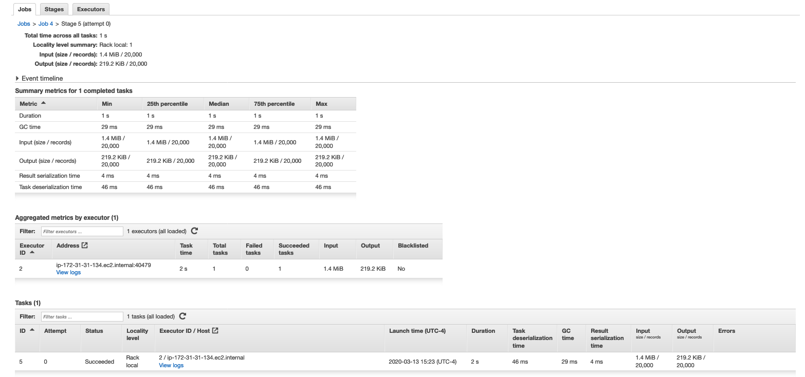
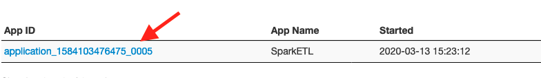

# Working with Spark, continued

There are several ways to monitor Spark job status and logs on Amazon EMR. Those are:

- Check Spark job logs on the command line
- Check YARN Application logs on Amazon EMR Console
- Check status and logs on Spark UI

## Check Spark logs on the command line

When Spark jobs are submitted through spark-submit on the command line, you can see logs on the console. You can pipe that output to a file and grep that file to troubleshoot or you can check the status, output, debug printout on the terminal as well. In the last exercise, you reviewed the logs from the command line, such as this:

## Check YARN Application logs on Amazon EMR Console

Spark jobs submitted on Amazon EMR clusters run as YARN applications. You can view YARN application details using the Application history tab of a cluster's detail page in the console. Using Amazon EMR application history makes it easier for you to troubleshoot and analyze active jobs and job history. Instead of setting up and connecting to the master node to view open-source troubleshooting UIs or sift through log files, you can quickly view application metrics and access relevant log files.

* Go to Amazon EMR console browser tab, click on the Application history tab, and click the Refresh icon to see the YARN history information

* Click on the Application ID to get more details

* Play around with the data you can see.  For instance, click into a specific Job by clicking on its Description.  Then click on a specific Stage by clicking on its Description.  After you get to the Stage detail level, you can get access to logs as seen here:

By clicking on View Logs, you can see the actual log files.  Note: there may a few minute delay before log files are available for viewing.  Logs are moved asynchronously to S3 as a background process.

## Check status and logs on Spark UI

The Spark History Server UI displays useful information about the Spark applications you submit on Amazon EMR.

* Click on the Summary tab and then on the Spark history server UI link

This will open the SparkUI History Server:

* Click on your Application ID

which will take you to the Spark UI:

* Navigate around the Spark UI as desired.

## Congratulations - you have explored how to view Spark logs with EMR

Please continue to the [next section](L4a-Notebook.md).
