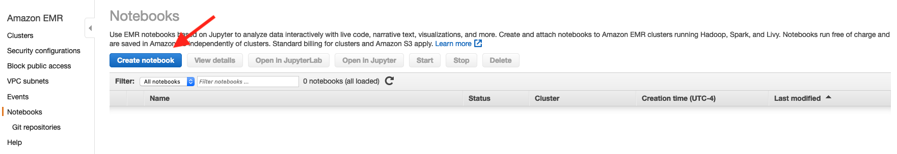
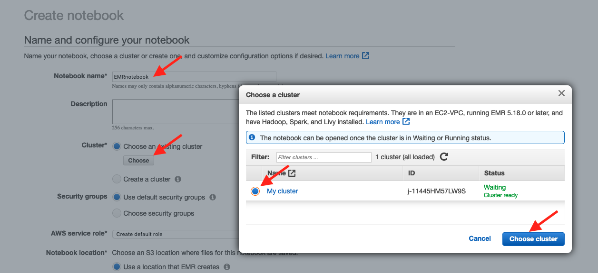
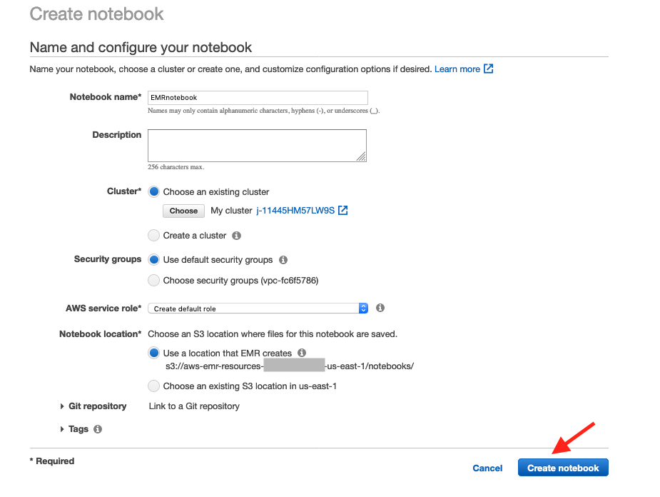
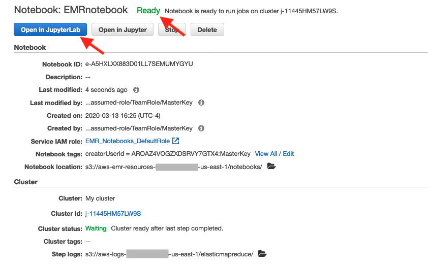
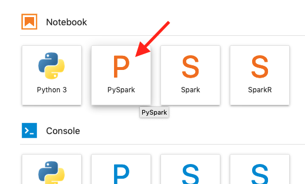
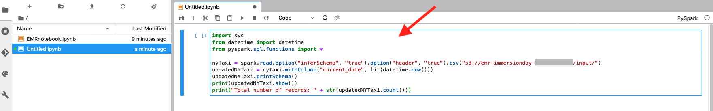
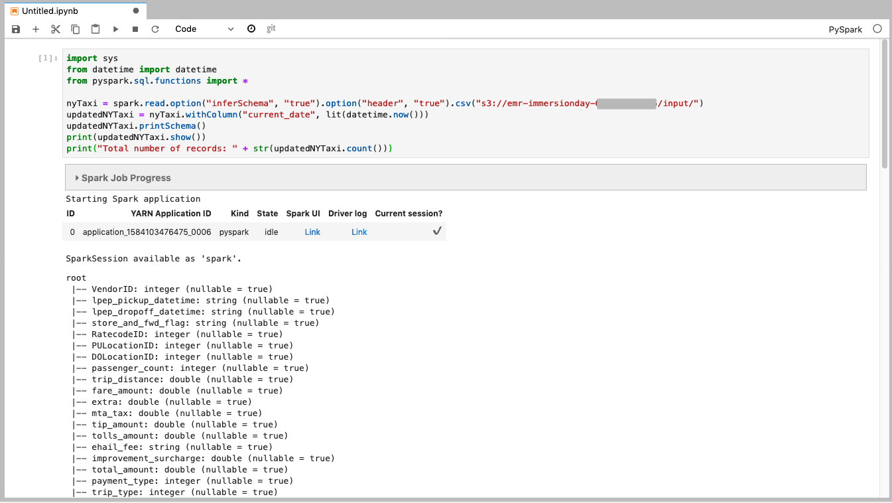

# Working with EMR Notebooks

Apache Spark on EMR is a popular tool for processing data for machine learning. Using Spark you can enrich and reformat large datasets. EMR Notebooks are familiar Jupyter notebooks that can connect/disconnect to EMR clusters and run Spark jobs on the cluster. The notebook code is persisted durably to S3. By using EMR Notebooks you separate the execution (EMR) and code development (Notebook) environments. Using EMR Notebooks allows you to share the EMR cluster between users and move the development environment to other clusters as needed. 

## Create an EMR Notebook

* Go to Amazon EMR console browser tab, and click on Notebooks on the left-hand column


* Click on Create notebook



* Enter "EMRnotebook" for the name.  Then click on the Choose button to choose an existing cluster.  Select your cluster.  Then click Choose cluster.



* Leave the rest at their defaults and click Create notebook



* Wait for your Notebook to be Ready.  Then click Open in JupyterLab



Your JupyterLab environment should open:


## Create a PySpark code with our S3 bucket name

* Switch to your Cloud9 environment and using the terminal tab where you created your S3 bucket, run these commands:

```
## creates a PySpark script substituting your bucket name
cat <<EOF00 > jupyter.py
import sys
from datetime import datetime
from pyspark.sql.functions import *

nyTaxi = spark.read.option("inferSchema", "true").option("header", "true").csv("s3://$BUCKET/input/")
updatedNYTaxi = nyTaxi.withColumn("current_date", lit(datetime.now()))
updatedNYTaxi.printSchema()
print(updatedNYTaxi.show())
print("Total number of records: " + str(updatedNYTaxi.count()))

EOF00

cat jupyter.py

```

which will give you output like this:


* Copy the generated script to your clipboard


## Create a PySpark Notebook

* Back in the JupyterLab tab, click on PySpark under Notebook



* In the empty paragraph, paste in the generated PySpark script



* Click the Play icon to run it


The paragraph will run for a few minutes and it will update its output as it runs.  You should see output like this:



...


## Congratulations - you have created an EMR Notebook, connected it to your cluster, and run PySpark scripts

Thank you for your time and attention.  Please continue to the [next section](NextSteps.md).
